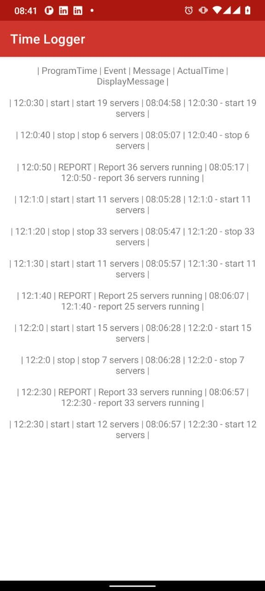
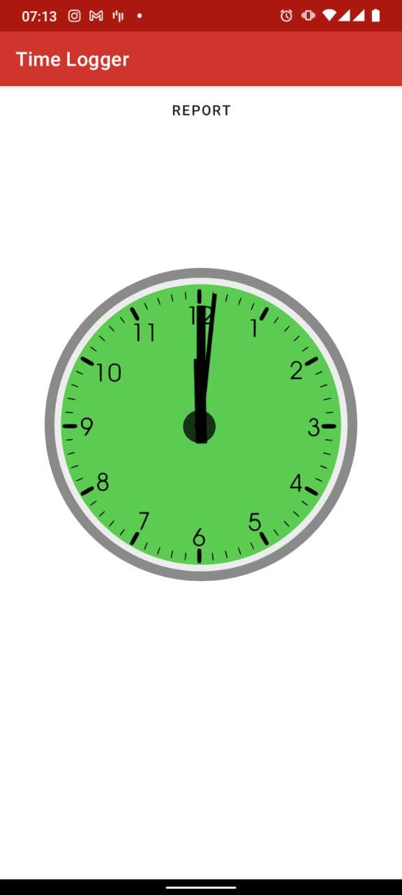

# Timer Logger
This is a take away assignment

## Prerequisite

- This project uses the Gradle build system,JDK 11. To build this project, use the
  `gradlew build` command after unzipping the folder or use "Import Project" in Android Studio.

- Use the latest android studio ide build and run this project

## Running the app

- After setting up the sample backend project the url copied from ngrok should be replaced in the
  file below.
- Path to file in the app module `src/main/java/com/github/didahdx/timelogger/common/Constant.kt`
- Paste your url in the variable `ENDPOINT_API`
- Sample url for demonstration `http://c745-105-163-2-61.ngrok.io/` use the url copied from ngrok
- It should look similar to this

```
object Constant {
    const val ENDPOINT_API="http://c745-105-163-2-61.ngrok.io/"
}
```
- Build the project and run it.

## sample video
- [Demo Video of App running](https://drive.google.com/file/d/1XkVZvd5QQ0C6-rxQxd-PwbjF8rrwUoFQ/view?usp=sharing)

## ScreenShot
  
  
  
  


## Testing
- All tests are under the Android Test package. All the tests are run using JUnit.

## Libraries
Libraries used in the whole application are:
- [ViewModel](https://developer.android.com/topic/libraries/architecture/viewmodel) - Manage UI related data in a lifecycle conscious way
- [RxJava](https://github.com/ReactiveX/RxJava) - RxJava is a Java VM implementation of Reactive Extensions: a library for composing asynchronous and event-based programs by using observable sequences.
- [Kotlin.coroutines](https://developer.android.com/kotlin/coroutines?gclid=Cj0KCQjw1dGJBhD4ARIsANb6Odld-9wkN4Lkm6UJAvWRshusopwstZH5IXkSLzxv_Q5JYjgjozIywfcaAlS9EALw_wcB&gclsrc=aw.ds) - Concurrency design pattern that you can use on Android to simplify code that executes asynchronously.
- [Dagger2](https://dagger.dev/dev-guide/) - Used for Dependency injection
# Time-Logger
